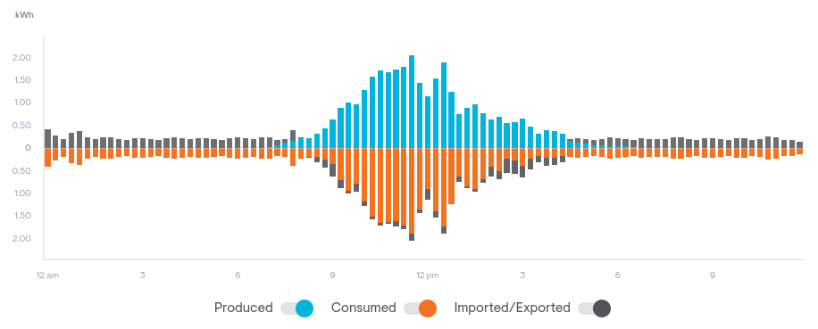
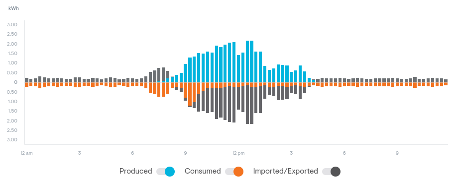

# Introduction

My house has grid-tied PV solar and an EVSE to charge my electric car.

This project monitors the PV system and charges the car with any surplus
electricity generated, rather than selling it back to the grid.

Modulate charging current based on energy being generated: 

When the car is finished charging, export the surplus: 

The code works like this:

- Read cumulative energy import/export from the Enphase Envoy over local
  Wifi, every minute.

- Compare previous minute's reading with current to compute average
  current imported/exported over the past minute.

- If we're exporting more than the minimum charge current of the OpenEVSE
  (6A), then set the EVSE's charge current to whatever we have available
  and turn on the EVSE.

- As current import/export fluctuates, adjust the EVSE's charge current
  limit; we're trying to charge using all surplus power but no imported
  power.

- If charge current drops below the 6A threshold, turn off the EVSE
  entirely.

# To do

- Upgrade EVSE Wifi firmware?

- Store MQTT OpenEVSE data in victoria-metrics, plot with grafana

- Store Enphase data in victoria-metrics, plot with grafana
